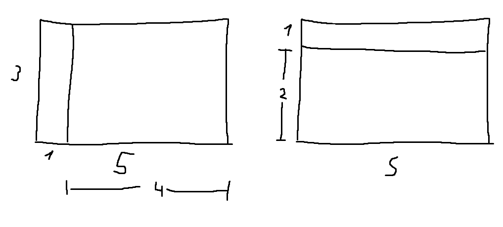

# Tarea Dev Junior - Ruuf

## 🎯 Objetivo

El objetivo de este ejercicio es poder entender tus habilidades como programador/a, la forma en que planteas un problema, cómo los resuelves y finalmente cómo comunicas tu forma de razonar y resultados.

## 🛠️ Problema

El problema a resolver consiste en encontrar la máxima cantidad de rectángulos de dimensiones "a" y "b" (paneles solares) que caben dentro de un rectángulo de dimensiones "x" e "y" (techo).

## 🚀 Cómo Empezar

### Opción 1: Solución en TypeScript
```bash
cd typescript
npm install
npm start
```

### Opción 2: Solución en Python
```bash
cd python
python3 main.py
```

## ✅ Casos de Prueba

Tu solución debe pasar los siguientes casos de prueba:
- Paneles 1x2 y techo 2x4 ⇒ Caben 4
- Paneles 1x2 y techo 3x5 ⇒ Caben 7
- Paneles 2x2 y techo 1x10 ⇒ Caben 0

---

## 📝 Tu Solución

**Video explicativo:** [https://drive.google.com/file/d/1ygidldRtHVGkyOUAsw1Kv0FoDx1NHLnA/view?usp=sharing]



---

## 💰 Bonus (Opcional)

Si completaste alguno de los ejercicios bonus, explica tu solución aquí:

### Bonus Implementado
*[Indica cuál bonus implementaste: Opción 1 (techo triangular) o Opción 2 (rectángulos superpuestos)]*
No lo realicé pero hubiera escogido la opción 2


### Explicación del Bonus
*[Explica cómo adaptaste tu algoritmo para resolver el bonus]*
Idealmente, habría separado las celdas de manera que quedaran disjuntas; es decir, dividir cada uno de los rectángulos en nueve rectángulos más pequeños, utilizando las posiciones existentes como límites. En el eje X, por ejemplo, se considerarían los puntos [0, dx, panel_width, panel_width + dx], donde dx representa el desplazamiento en X. Lo mismo se aplicaría en el eje Y, obteniendo así nueve rectángulos disjuntos. Quizás este enfoque resulte limitado, ya que no considera las superposiciones entre celdas, pero me pareció más adecuado para el contexto, dado el alto costo de los paneles.


---

## 🤔 Supuestos y Decisiones

*[Si tuviste que tomar algún supuesto o decisión de diseño, explícalo aquí]*

